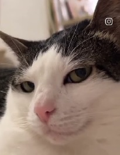

***
## 🖼️IMAGES🖼️
We can add images to make our MK more beatiful. There are two main ways to add images: from a local folder o project (relative paths) or from an URL (image URL or google drive)

##### FIRST IMAGE (LOCAL FOLDER)
The syntax would be the next: `[ALT TEXT]\(SRC IMG)`

for instance: ``

##### SECOND IMAGE (URL IMAGE)
The syntax would be the next: `[ALT TEXT]\(URL IMG)`

for instance: ``

#### THIRD IMAGE (DRIVE IMAGE)
**Work in progres**

***
